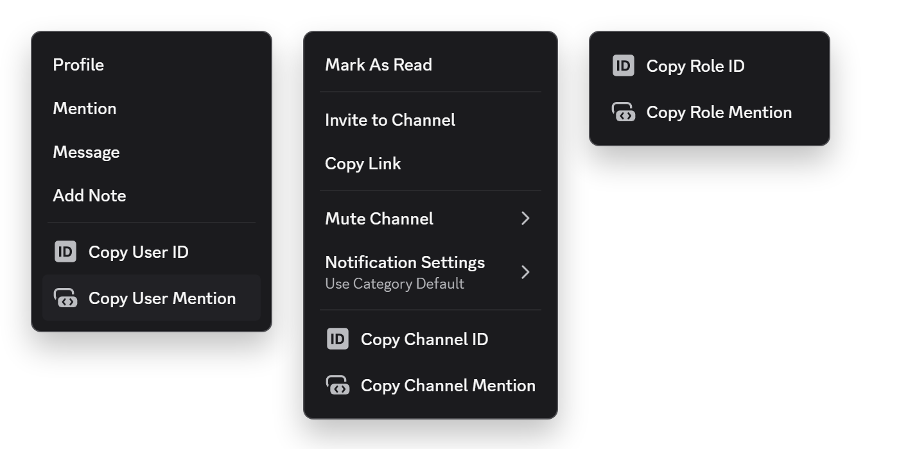

# copyMentions

copy a user, channel, role or slash command as a raw mention directly from the right click menu

| right click | copies |
| --- | --- |
| user or bot | `<@id>` |
| channel or thread | `<#id>` |
| role | `<@&id>` |
| slash command | `</name:id>` |

## good to know

- roles and command bar will have only a right click menu in developer mode enabled
- discord’s native commands like (`/shrug`, `/giphy`) and vencord commands cannot be mentioned
- the reply from the command will have the option only after discord has loaded the server commands. just opening the `/` picker is enough for this
- every option can be turned off in the plugin settings

## install

if you made it here you probably already know how to install custom plugins, but if not just check [vencord's guide](https://docs.vencord.dev/installing/custom-plugins/)
